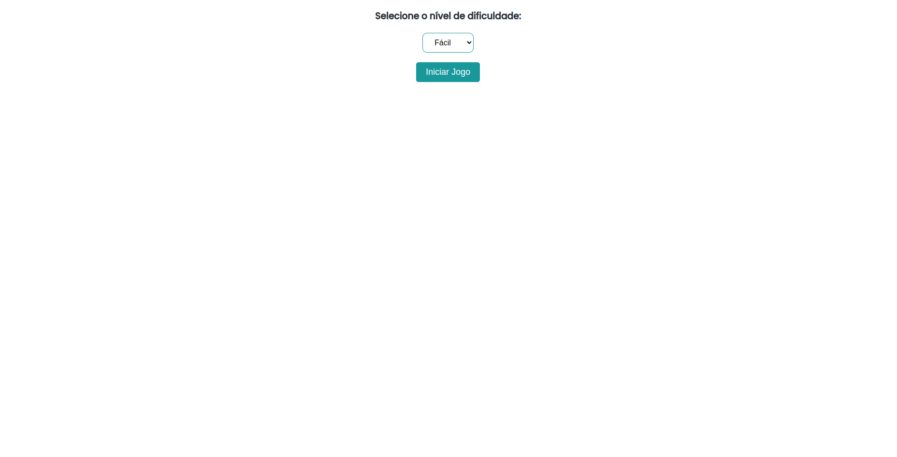
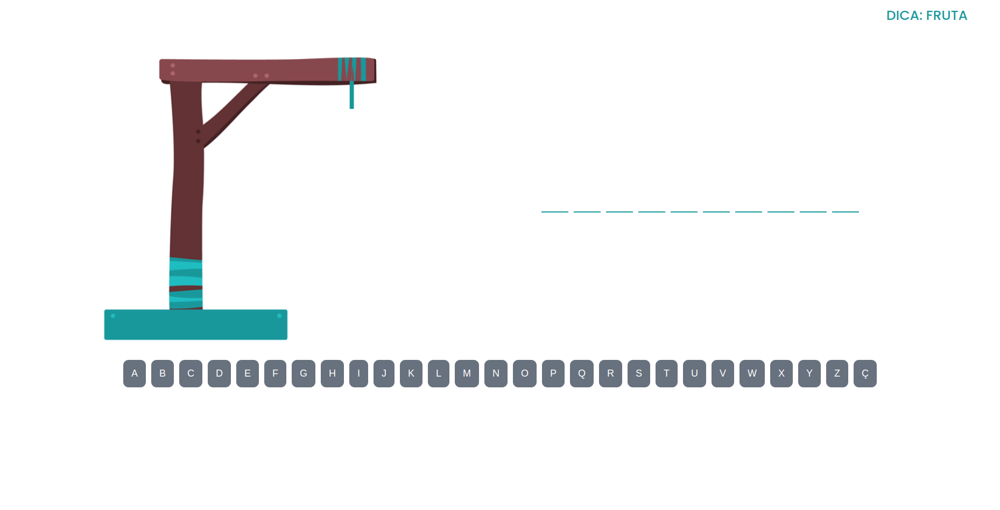
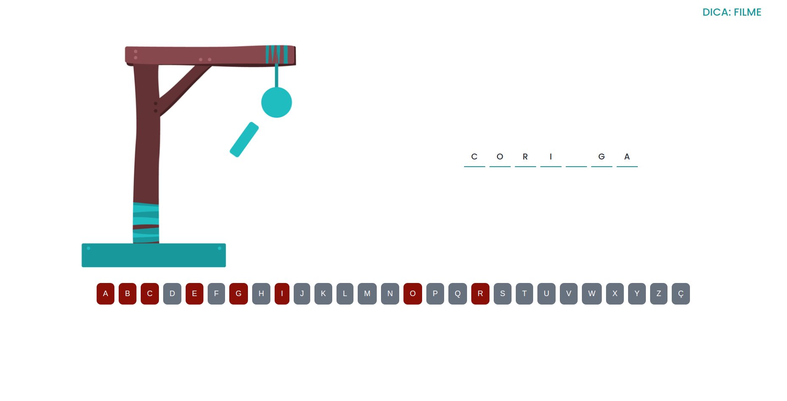
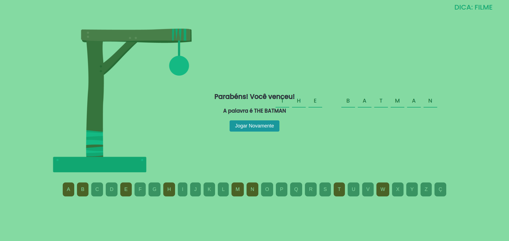

<h1 align="center">HANGMAN GAME</h1>

<a href="https://devhyago.github.io/hangman-game/">Access game</a>

In the hangman game, the player needs to choose a difficulty level, between easy, medium and difficult, after that the system will draw a category between the categories of teams, fruits, movies and series, after that the sentence will be drawn based on the level of difficulty chosen by the user.

<h2>See screenshots of the game below:</h2>

